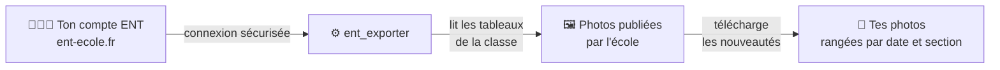

# 📸 ent_exporter

Récupère **automatiquement les photos** que l'école publie sur l'ENT
[Beneylu School](https://www.ent-ecole.fr) (« le cartable » / les tableaux de la classe),
et les range sur ton ordinateur ou ton cloud — sans avoir à les télécharger une par une.

> 🟢 Premier lancement : récupère **tout l'historique**.
> 🔁 Lancements suivants : récupère **seulement les nouvelles photos**.

## Comment ça marche



L'outil se connecte avec **tes identifiants ENT**, parcourt les tableaux de la classe,
et télécharge les photos qu'il ne possède pas encore. Tes identifiants restent **chez
toi** ; rien n'est envoyé ailleurs que vers l'ENT lui-même.

## Installation (Docker)

```bash
git clone <repo> && cd ent_exporter
cp .env.example .env   # puis renseigne ENT_LOGIN / ENT_PASSWORD
```

Deux façons de l'utiliser : l'**interface web** (galerie + bouton de sync) ou la **ligne
de commande**.

## Configuration

| Variable | Rôle | Défaut |
|---|---|---|
| `ENT_LOGIN` | identifiant ENT | — |
| `ENT_PASSWORD` | mot de passe ENT | — |
| `ENT_DATA_DIR` | dossier des photos | `./data` |
| `ENT_WEB_PASSWORD` | mot de passe d'accès à l'UI web (optionnel) | — (accès libre) |
| `ENT_SYNC_INTERVAL_HOURS` | sync automatique toutes les N heures (`0` = manuel) | `0` |

Les identifiants peuvent aussi se saisir directement dans la page **Configuration** de
l'UI ; ils sont stockés dans un fichier `chmod 600`. Les variables d'environnement
restent prioritaires.

## Utilisation

### Interface web (recommandé)

```bash
docker compose -f runtimes/docker/docker-compose.yml up web
```

Ouvre <http://127.0.0.1:8000> : renseigne tes identifiants ENT dans **Configuration**,
clique **Synchroniser maintenant**, puis parcours la galerie (photos groupées par tableau
puis par mois). Pour une sync automatique, règle la fréquence en heures
(`ENT_SYNC_INTERVAL_HOURS`). L'UI écoute sur `127.0.0.1` par défaut ; pour l'exposer sur
le réseau, définis `ENT_WEB_PASSWORD` (un avertissement est émis au démarrage sinon).

### En ligne de commande

```bash
docker compose -f runtimes/docker/docker-compose.yml run --rm ent-exporter login-test   # vérifie la connexion
docker compose -f runtimes/docker/docker-compose.yml run --rm ent-exporter list-boards  # liste les tableaux
docker compose -f runtimes/docker/docker-compose.yml run --rm ent-exporter sync         # télécharge les nouvelles photos
```

## Captures d'écran

> 🖼️ La galerie n'a d'intérêt qu'avec **tes propres photos** : lance une première sync,
> puis place tes captures dans `docs/screenshots/` et décommente les lignes ci-dessous.
>
> <!--  -->
> <!--  -->

## Vie privée & sécurité

- Tes identifiants ENT ne servent qu'à te connecter à `ent-ecole.fr`, **jamais partagés**.
- Conçu pour un **usage familial / self-hosted** : une installation = ton compte.
- Le code est ouvert et vérifiable.

---

📄 Détails techniques : [`CLAUDE.md`](CLAUDE.md) ·
[design](docs/superpowers/specs/2026-06-15-beneylu-photo-exporter-design.md)
