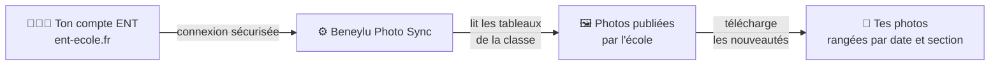
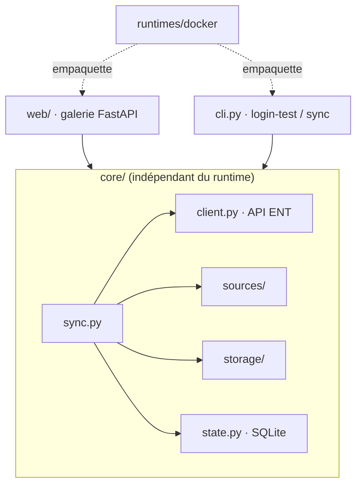

# 📸 Beneylu Photo Sync

Récupère **automatiquement les photos** que l'école publie sur l'ENT
[Beneylu School](https://www.ent-ecole.fr) (« le cartable » / les tableaux de la classe),
et les range chez toi, sans avoir à les enregistrer une par une.

> 🟢 Premier lancement : récupère **tout l'historique**.
> 🔁 Lancements suivants : récupère **seulement les nouvelles photos**.

## Comment ça marche



L'outil se connecte avec **tes identifiants ENT**, parcourt les tableaux de la classe,
et télécharge les photos qu'il ne possède pas encore. Chaque photo est rangée dans
`tableau / mois / section`, et garde sa date d'origine. Tes identifiants restent **chez
toi** ; rien n'est envoyé ailleurs que vers l'ENT lui-même.

## Démarrage rapide (Docker)

```bash
git clone <repo> && cd beneylu-photo-sync
cp .env.example .env      # puis renseigne ENT_LOGIN / ENT_PASSWORD
```

Tout tourne en conteneur, sans installer Python sur ta machine. Deux façons de
l'utiliser : l'**interface web** (galerie + bouton de sync) ou la **ligne de commande**.

### Interface web (recommandé)

```bash
docker compose -f runtimes/docker/docker-compose.yml up web
```

Ouvre <http://127.0.0.1:8000>, renseigne tes identifiants ENT dans **Configuration**,
clique **Synchroniser maintenant**, puis parcours la galerie. Les photos sont groupées
par tableau puis par mois ; la barre de recherche filtre en direct (accents ignorés), et
un clic ouvre la visionneuse plein écran avec navigation au clavier et téléchargement. La
date de la dernière synchronisation s'affiche dans le bandeau.

Le menu à côté du bouton **Synchroniser** permet de **choisir les tableaux** à récupérer
(pratique pour ignorer ceux sans photos), de forcer une **resynchronisation complète**, ou
de **tout supprimer**.

Tu peux récupérer **tout en une archive ZIP**, ou seulement une section. Pour une sync
automatique, règle la fréquence en heures (`ENT_SYNC_INTERVAL_HOURS`). Elle s'applique au
redémarrage du service. Une **police adaptée à la dyslexie** (OpenDyslexic) est aussi
proposée dans la page Configuration.

### En ligne de commande

```bash
COMPOSE="docker compose -f runtimes/docker/docker-compose.yml"
$COMPOSE run --rm sync login-test    # vérifie la connexion
$COMPOSE run --rm sync list-boards   # liste les tableaux du compte
$COMPOSE run --rm sync sync          # télécharge les nouvelles photos
```

## Configuration

Les identifiants se donnent par variables d'environnement (`.env`) **ou** directement dans
la page **Configuration** de l'UI. Dans ce cas ils sont stockés dans un fichier `chmod
600`. Les variables d'environnement restent prioritaires.

| Variable | Rôle | Défaut |
|---|---|---|
| `ENT_LOGIN` | identifiant ENT | — |
| `ENT_PASSWORD` | mot de passe ENT | — |
| `ENT_DATA_DIR` | dossier des photos | `./data` |
| `ENT_STATE_DB` | base SQLite qui mémorise ce qui est déjà téléchargé | `./state.db` |
| `ENT_EXCLUDED_BOARDS` | tableaux à ne pas synchroniser (séparés par des virgules) | — |
| `ENT_SYNC_WORKERS` | nombre de téléchargements en parallèle | `4` |
| `ENT_BASE_URL` | racine de l'API ENT | `https://www.ent-ecole.fr` |

Variables propres à l'interface web :

| Variable | Rôle | Défaut |
|---|---|---|
| `ENT_SYNC_INTERVAL_HOURS` | sync automatique toutes les N heures (`0` = manuel) | `0` |
| `ENT_WEB_PASSWORD` | mot de passe d'accès à l'UI (optionnel) | — (accès libre) |
| `ENT_WEB_HOST` | interface d'écoute | `127.0.0.1` |
| `ENT_WEB_PORT` | port d'écoute | `8000` |

Un tableau exclu déjà synchronisé est **supprimé du disque** à la sync suivante. Si une
photo connue disparaît du dossier, elle est **re-téléchargée** automatiquement.

## Exposer l'UI sur le réseau

Par défaut l'interface n'écoute que sur `127.0.0.1` : seule ta machine y accède. Pour
l'ouvrir au réseau local, mets `ENT_WEB_HOST=0.0.0.0`, et définis alors un
`ENT_WEB_PASSWORD`. Sinon n'importe qui sur le réseau verra tes photos (un avertissement
est émis au démarrage dans ce cas).

## Sous le capot

Le cœur (`core/`) ne dépend d'aucun runtime ; l'UI web et la ligne de commande se posent
par-dessus, et les conteneurs empaquettent l'ensemble.



```
src/beneylu_photo_sync/
├── core/            # logique métier, indépendante du runtime
│   ├── client.py        # client HTTP de l'API ENT (auth, refresh, download)
│   ├── sources/         # d'où viennent les photos (cardboard = tableaux de classe)
│   ├── storage/         # où elles atterrissent (filesystem par défaut)
│   ├── state.py         # SQLite : idempotence par identifiant de média
│   ├── naming.py        # arborescence tableau / mois / section
│   └── sync.py          # orchestre tout (téléchargements parallèles bornés)
├── web/             # interface FastAPI : galerie, config, ZIP, scheduler
└── cli.py           # commandes login-test / list-boards / sync
runtimes/docker/     # Dockerfile (CLI), Dockerfile.web (UI), docker-compose
```

Une nouvelle source de photos ou un nouveau backend de stockage s'ajoute en
implémentant son interface dans `sources/` ou `storage/`, sans toucher au cœur.

## Développement

Tout passe par des conteneurs jetables, jamais par un environnement Python local.

```bash
make check    # lint (ruff) + tests (pytest), le critère de « fini »
make test     # tests seuls
make lint     # ruff seul
make build    # construit l'image runtime
make css      # recompile la feuille Tailwind (après modif des templates)
```

## Vie privée & sécurité

- Tes identifiants ENT ne servent qu'à te connecter à `ent-ecole.fr`, **jamais partagés**,
  jamais écrits dans les logs ni dans la base d'état.
- Conçu pour un **usage familial / self-hosted** : une installation = ton compte.
- Le code est ouvert et vérifiable.

---

📄 Détails techniques : [`CLAUDE.md`](CLAUDE.md) ·
[design](docs/superpowers/specs/2026-06-15-beneylu-photo-exporter-design.md)
