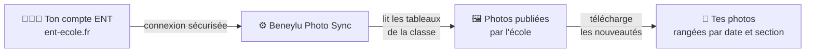
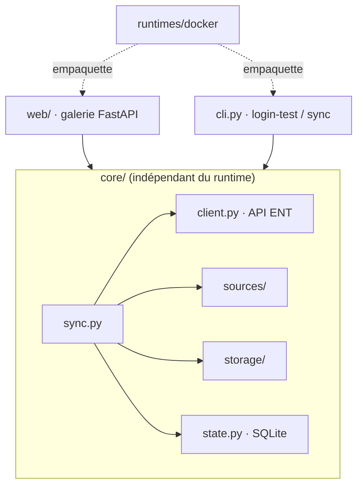

# 📸 Beneylu Photo Sync

Récupère **automatiquement les photos** que l'école publie sur l'ENT
[Beneylu School](https://www.ent-ecole.fr) (« le cartable » / les tableaux de la classe),
et les range chez toi, sans avoir à les enregistrer une par une.

> 🟢 Premier lancement : récupère **tout l'historique**.
> 🔁 Lancements suivants : récupère **seulement les nouvelles photos**.

## Fonctionnalités

- **Synchronisation incrémentale** : le premier passage rapatrie tout, les suivants ne prennent que les nouveautés.
- **Galerie web** : photos groupées par tableau et par mois, recherche instantanée, visionneuse plein écran.
- **Choix des tableaux** : tu coches ceux à récupérer et ignores ceux qui ne contiennent pas de photos.
- **Téléchargement** : une photo, une section, ou toute la galerie en une archive ZIP.
- **Sync automatique** à intervalle réglable, ou à la demande d'un clic.
- **Accessibilité** : thème clair/sombre et police adaptée à la dyslexie.
- **Ligne de commande** pour les automatisations. Tout est **self-hosted**, sans navigateur côté serveur.

## Comment ça marche



L'outil se connecte avec **tes identifiants ENT**, parcourt les tableaux de la classe, et
télécharge les photos qu'il ne possède pas encore. Chaque photo est rangée dans
`tableau / mois / section` et garde sa date d'origine. Tes identifiants restent **chez
toi** ; rien n'est envoyé ailleurs que vers l'ENT lui-même.

## Démarrage rapide

Tout tourne en conteneur, sans installer Python sur ta machine.

```bash
git clone https://github.com/SckyzO/beneylu-photo-sync.git
cd beneylu-photo-sync
cp .env.example .env      # renseigne ENT_LOGIN / ENT_PASSWORD
docker compose -f runtimes/docker/docker-compose.yml up web
```

Ouvre <http://127.0.0.1:8000> et clique **Synchroniser maintenant**. Les variables de
configuration sont détaillées [plus bas](#configuration).

## Utilisation

### Interface web

- **Galerie & recherche** : les photos sont groupées par tableau puis par mois. La barre de recherche filtre en direct, accents ignorés.
- **Visionneuse** : un clic ouvre la photo en plein écran, avec navigation au clavier et bouton de téléchargement.
- **Synchroniser** : le bouton lance une sync immédiate. Le menu juste à côté permet de **choisir les tableaux** à récupérer, de forcer une **resynchronisation complète**, ou de **tout supprimer**. La date de la dernière sync s'affiche dans le bandeau.
- **Télécharger** : une photo depuis la visionneuse, ou une archive **ZIP** de toute la galerie ou d'une seule section.
- **Sync automatique** : règle `ENT_SYNC_INTERVAL_HOURS` ; elle s'applique au redémarrage du service.

### Ligne de commande

```bash
COMPOSE="docker compose -f runtimes/docker/docker-compose.yml"
$COMPOSE run --rm sync login-test    # vérifie la connexion
$COMPOSE run --rm sync list-boards   # liste les tableaux du compte
$COMPOSE run --rm sync sync          # télécharge les nouvelles photos
```

Un tableau exclu déjà synchronisé est **supprimé du disque** à la sync suivante. Et si une
photo connue disparaît du dossier, elle est **re-téléchargée** automatiquement.

## Configuration

Les identifiants se donnent par variables d'environnement (`.env`) **ou** directement dans
la page **Configuration** de l'interface. Dans ce dernier cas ils sont stockés dans un
fichier `chmod 600`. Les variables d'environnement restent prioritaires.

| Variable | Rôle | Défaut |
|---|---|---|
| `ENT_LOGIN` | identifiant ENT | — |
| `ENT_PASSWORD` | mot de passe ENT | — |
| `ENT_DATA_DIR` | dossier des photos | `./data` |
| `ENT_STATE_DB` | base SQLite qui mémorise ce qui est déjà téléchargé | `./state.db` |
| `ENT_EXCLUDED_BOARDS` | tableaux à ignorer (séparés par des virgules) | — |
| `ENT_SYNC_WORKERS` | téléchargements en parallèle | `4` |
| `ENT_BASE_URL` | racine de l'API ENT | `https://www.ent-ecole.fr` |

Variables propres à l'interface web :

| Variable | Rôle | Défaut |
|---|---|---|
| `ENT_SYNC_INTERVAL_HOURS` | sync automatique toutes les N heures (`0` = manuel) | `0` |
| `ENT_WEB_PASSWORD` | mot de passe d'accès à l'UI (optionnel) | — (accès libre) |
| `ENT_WEB_HOST` | interface d'écoute | `127.0.0.1` |
| `ENT_WEB_PORT` | port d'écoute | `8000` |

## Sécurité & vie privée

- Tes identifiants ENT ne servent qu'à te connecter à `ent-ecole.fr`. Ils ne sont **jamais partagés**, ni écrits dans les logs ou dans la base d'état.
- Par défaut l'interface n'écoute que sur `127.0.0.1` : seule ta machine y accède. Pour l'ouvrir au réseau local, mets `ENT_WEB_HOST=0.0.0.0` et définis un `ENT_WEB_PASSWORD`. Sans mot de passe, n'importe qui sur le réseau verrait tes photos, et un avertissement est émis au démarrage.
- Conçu pour un **usage familial / self-hosted** : une installation, un compte. Le code est ouvert et vérifiable.

## Architecture

Le cœur (`core/`) ne dépend d'aucun runtime ; l'interface web et la ligne de commande se
posent par-dessus, et les conteneurs empaquettent l'ensemble.



```
src/beneylu_photo_sync/
├── core/            # logique métier, indépendante du runtime
│   ├── client.py        # client HTTP de l'API ENT (auth, refresh, download)
│   ├── sources/         # d'où viennent les photos (cardboard = tableaux de classe)
│   ├── storage/         # où elles atterrissent (filesystem par défaut)
│   ├── state.py         # SQLite : idempotence par identifiant de média
│   ├── naming.py        # arborescence tableau / mois / section
│   └── sync.py          # orchestre tout (téléchargements parallèles bornés)
├── web/             # interface FastAPI : galerie, config, ZIP, scheduler
└── cli.py           # commandes login-test / list-boards / sync
runtimes/docker/     # Dockerfile (CLI), Dockerfile.web (UI), docker-compose
```

Une nouvelle source de photos ou un nouveau backend de stockage s'ajoute en implémentant
son interface dans `sources/` ou `storage/`, sans toucher au cœur.

## Développement

Tout passe par des conteneurs jetables, jamais par un environnement Python local.

```bash
make check    # lint (ruff) + tests (pytest), le critère de « fini »
make test     # tests seuls
make lint     # ruff seul
make build    # construit l'image runtime
make css      # recompile la feuille Tailwind (après modif des templates)
```

---

Développé par Thomas Bourcey. Notes techniques internes : [`CLAUDE.md`](CLAUDE.md).
