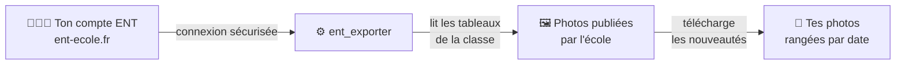

# 📸 ent_exporter

Récupère **automatiquement les photos** que l'école publie sur l'ENT
[Beneylu School](https://www.ent-ecole.fr) (« le cartable » / les tableaux de la classe),
et les range sur ton ordinateur ou ton cloud — sans avoir à les télécharger une par une.

> 🟢 Premier lancement : récupère **tout l'historique**.
> 🔁 Lancements suivants : récupère **seulement les nouvelles photos**.

## Comment ça marche



L'outil se connecte avec **tes identifiants ENT**, parcourt les tableaux de la classe,
et télécharge les photos qu'il ne possède pas encore. Tes identifiants restent **chez
toi** ; rien n'est envoyé ailleurs que vers l'ENT lui-même.

## Installation

> ⏳ _Sera complété à la sortie de la v1._ Deux modes prévus :

- **Docker** (recommandé) — un conteneur avec une petite interface web. Idéal sur un NAS,
  un Raspberry Pi ou un PC qui reste allumé.
- **Sans serveur (GitHub Actions)** — gratuit, tourne tout seul à intervalle régulier et
  envoie les photos sur Google Drive.

## Configuration

> ⏳ _Sera complété à la sortie de la v1._ Tu auras besoin de :

- ton **identifiant** et ton **mot de passe** ENT (les mêmes que sur `ent-ecole.fr`) ;
- le **dossier de destination** des photos (disque local par défaut, Google Drive en option) ;
- la **fréquence** de vérification (ex. une fois par jour).

## Utilisation

> ⏳ _Sera complété à la sortie de la v1._ Aperçu prévu :

```bash
ent-exporter login-test     # vérifie que la connexion fonctionne
ent-exporter list-boards    # liste les tableaux de la classe
ent-exporter sync           # télécharge les nouvelles photos
```

En mode Docker, tout se pilote depuis l'**interface web** (configurer, lancer une
synchro, voir la galerie).

## Captures d'écran

> ⏳ _À venir avec l'interface web (v1)._
>
> <!--  -->
> <!--  -->

## Vie privée & sécurité

- Tes identifiants ENT ne servent qu'à te connecter à `ent-ecole.fr`, **jamais partagés**.
- Conçu pour un **usage familial / self-hosted** : une installation = ton compte.
- Le code est ouvert et vérifiable.

---

📄 Détails techniques : [`CLAUDE.md`](CLAUDE.md) ·
[design](docs/superpowers/specs/2026-06-15-beneylu-photo-exporter-design.md)
